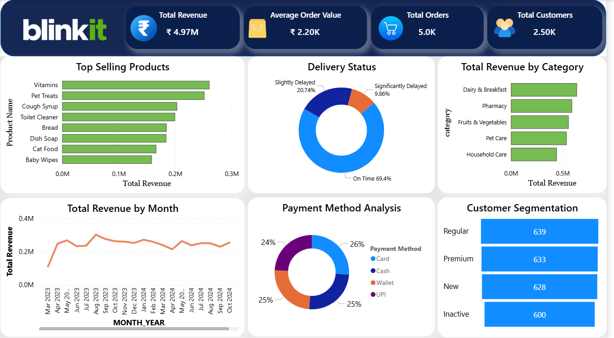

# Blinkit Sales & Operations Dashboard

## Project Overview
Developed an interactive Power BI dashboard to analyze Blinkit retail sales performance, delivery operations, customer behavior, and product trends using SQL and Power BI.

This dashboard provides business insights into revenue trends, delivery efficiency, customer segmentation, payment behavior, and top-performing product categories.

---

## Tools & Technologies Used
- SQL
- Power BI
- DAX
- Data Modeling
- Data Visualization

---

## Key Dashboard Features
- Executive KPI Tracking
- Monthly Revenue Trend Analysis
- Delivery Status Monitoring
- Payment Method Analysis
- Customer Segmentation
- Top Selling Products Analysis
- Revenue by Category

---

## SQL Concepts Used
- INNER JOIN
- GROUP BY
- Aggregate Functions
- SQL Views
- DISTINCT COUNT
- Data Cleaning & Transformation

---

## Key Business Insights
- On-time deliveries accounted for approximately 69% of total deliveries.
- Dairy & Breakfast generated the highest category revenue.
- Card and Cash were among the most frequently used payment methods.
- Revenue trends remained relatively stable across most months.
- Top-selling products contributed significantly to total revenue concentration.

---

## Dashboard Preview

---

## Project Files
- `Blinkit_Operations_Dashboard.pbix` → Power BI Dashboard File
- `Blinkit.sql` → SQL Queries & Views
- `Dashboard_Overview.png` → Final Dashboard Screenshot

---

## Author
Sachin Kumar Chauhan
